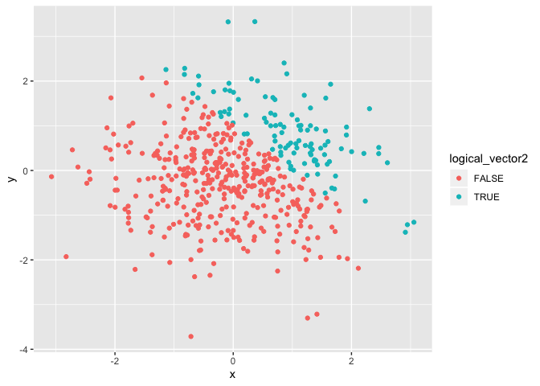
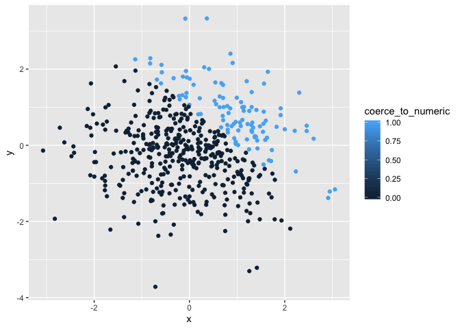
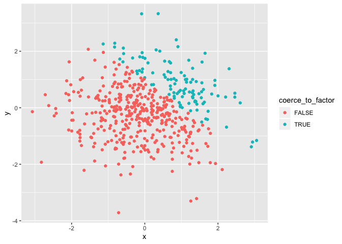

p8105\_hw1\_jl5549
================

``` r
samp <- rnorm(8) #a random sample of size 8 from a standard Normal distribution
logical_vector <- samp > 0 #a logical vector indicating whether elements of the sample are greater than 0
character_vector <- c("cat","cat","pig","pig","dog","cat","pig","dog") #a character vector of length 8
factor_vector <- factor(c("cat","cat","pig","pig","dog","cat","pig","dog")) #a factor vector of length 8, with 3 different factor “levels”
df <- data.frame(samp, logical_vector, character_vector, factor_vector) #Create a data frame comprised of all variables above

mean(samp)
```

    ## [1] -0.3755042

``` r
mean(logical_vector)
```

    ## [1] 0.25

``` r
mean(character_vector)
```

    ## Warning in mean.default(character_vector): argument is not numeric or
    ## logical: returning NA

    ## [1] NA

``` r
mean(factor_vector) # When taking the mean of each variable of the dataframe,  the random sample and the logical vector work, but the character and factor vector don't
```

    ## Warning in mean.default(factor_vector): argument is not numeric or logical:
    ## returning NA

    ## [1] NA

``` r
as.numeric(logical_vector) #applies the as.numeric function to the logical variables
as.numeric(factor_vector) #applies the as.numeric function to the factor variables
as.numeric(character_vector) #applies the as.numeric function to the factor variables

#The as.numeric funcrtion doesn't work on  the character vector. Beacause for logcial virables , one can use number to indicate true of false. And for factor variables, there are several levels that can be converted as numbers as well. But for character variable, there is no such a way to use numbers to indicate characters. 
# This helps explain why we can take the mean of logical viables and why we can't take the mean of character. But why we can't take the mean of factor variables remains unexplained.
```

``` r
convert_to_numeric <- as.numeric(logical_vector)
result1 <- samp * convert_to_numeric
#convert the logical vector to numeric, and multiply the random sample by the result
convert_to_factor <- as.factor(logical_vector)
result2 <- samp * convert_to_factor
```

    ## Warning in Ops.factor(samp, convert_to_factor): '*' not meaningful for
    ## factors

``` r
#convert the logical vector to a factor, and multiply the random sample by the result
convert_to_factor_to_numeric <- as.numeric(convert_to_factor)
result3 <- samp * convert_to_factor_to_numeric
#convert the logical vector to a factor and then convert the result to numeric, and multiply the random sample by the result
```

``` r
x <- rnorm(500) #a random sample of size 500 from a standard Normal distribution
y <- rnorm(500) #a random sample of size 500 from a standard Normal distribution
logical_vector2 <- (x + y) > 1 #A logical vector indicating whether x + y > 1
coerce_to_numeric = as.numeric(logical_vector2) #A numeric vector created by coercing the above logical vector
coerce_to_factor = as.factor(logical_vector2) #A factor vector created by coercing the above logical vector
df2 <- data.frame(x, y, logical_vector2, coerce_to_numeric, coerce_to_factor) #Create a data frame comprised of all variables above
```

\#the size of the dataset : row = 500, col = \* the mean = 0.015808,
median = -0.0328051, and standard deviation of x = 1.0317693\* the
proportion of cases for which x + y \> 1 is 0.788, 0.212

``` r
ggplot(df2, aes(x, y, color = logical_vector2)) +
  geom_point()
```

<!-- -->

``` r
ggsave('scatterplot_xy.png', path='./')
```

    ## Saving 7 x 5 in image

``` r
# Make a scatterplot of y vs x; color points using the logical variable 
```

``` r
ggplot(df2, aes(x, y, color = coerce_to_numeric)) +
  geom_point()
```

<!-- -->

``` r
#Make a scatterplot of y vs x; color points using the numeric variable 
```

``` r
ggplot(df2, aes(x, y, color = coerce_to_factor)) + 
  geom_point()
```

<!-- -->

``` r
#Make a scatterplot of y vs x; color points using the factor variable 
```
